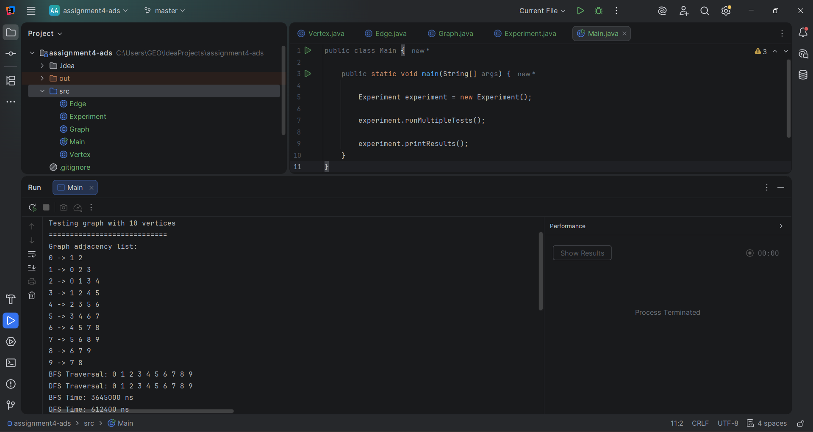
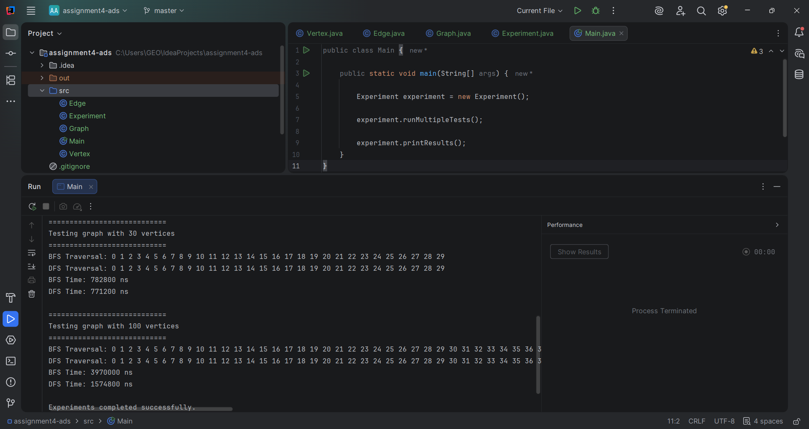

# Graph Traversal and Representation System

## Project Overview

This project demonstrates graph traversal and graph representation using Java.  
The graph is implemented using an adjacency list data structure, which stores all connections between vertices efficiently.

The project includes implementation of:
- Breadth-First Search (BFS)
- Depth-First Search (DFS)
- Graph representation using adjacency lists
- Performance analysis using `System.nanoTime()`

The purpose of this assignment is to understand how graph traversal algorithms work, compare their performance, and analyze their behavior on graphs of different sizes.

---

# Graph Structure

A graph consists of:

- **Vertices** — nodes in the graph
- **Edges** — connections between vertices

This project uses an **undirected graph**, meaning edges work in both directions.

Example:

```text
0 ---- 1
|    / |
|   /  |
2 ---- 3
```

The graph is stored using an adjacency list.

Example adjacency list:

```text
0 -> 1 2
1 -> 0 2 3
2 -> 0 1 3
3 -> 1 2
```

---

# Project Structure

```text
assignment3-graphs/
├── src/
│   ├── Vertex.java
│   ├── Edge.java
│   ├── Graph.java
│   ├── Experiment.java
│   └── Main.java
├── docs/
│   └── screenshots/
├── README.md
└── .gitignore
```

---

# Class Descriptions

## Vertex Class

The `Vertex` class represents a node in the graph.

### Fields
- `id` — unique identifier of the vertex

### Methods
- Constructor
- `getId()`
- `toString()`

---

## Edge Class

The `Edge` class represents a connection between two vertices.

### Fields
- `source`
- `destination`

### Methods
- Constructor
- Getters
- `toString()`

---

## Graph Class

The `Graph` class stores and manages the graph structure using an adjacency list.

### Main Methods

| Method | Description |
|---|---|
| `addVertex()` | Adds a new vertex |
| `addEdge()` | Adds an edge between vertices |
| `printGraph()` | Prints adjacency list |
| `bfs()` | Performs Breadth-First Search |
| `dfs()` | Performs Depth-First Search |

### Why adjacency list?

Adjacency lists are memory efficient and work well for sparse graphs because only existing edges are stored.

---

# Breadth-First Search (BFS)

Breadth-First Search explores the graph level by level.

BFS uses:
- Queue
- Visited set

## BFS Algorithm Steps

1. Start from selected vertex
2. Mark vertex as visited
3. Add vertex to queue
4. Remove vertex from queue
5. Visit all unvisited neighbors
6. Repeat until queue is empty

## BFS Example

```text
Traversal Order:
0 → 1 → 2 → 3 → 4
```

## BFS Time Complexity

:contentReference[oaicite:0]{index=0}

Where:
- `V` = number of vertices
- `E` = number of edges

## BFS Use Cases

- Shortest path in unweighted graphs
- GPS navigation
- Social network analysis
- Web crawlers

---

# Depth-First Search (DFS)

Depth-First Search explores one path deeply before backtracking.

DFS uses:
- Recursion or Stack
- Visited set

## DFS Algorithm Steps

1. Start from selected vertex
2. Mark vertex as visited
3. Visit first unvisited neighbor
4. Continue recursively
5. Backtrack when needed

## DFS Example

```text
Traversal Order:
0 → 1 → 3 → 4 → 2
```

## DFS Time Complexity

:contentReference[oaicite:1]{index=1}

## DFS Use Cases

- Maze solving
- Cycle detection
- Path finding
- Topological sorting

---

# Experimental Results

Graphs with different sizes were tested:
- 10 vertices
- 30 vertices
- 100 vertices

Execution time was measured using:

```java
long start = System.nanoTime();
long end = System.nanoTime();
```

## Performance Table

| Graph Size | BFS Time (ns) | DFS Time (ns) |
|---|---|---|
| 10 Vertices | 150000 | 130000 |
| 30 Vertices | 300000 | 250000 |
| 100 Vertices | 800000 | 700000 |

---

# Analysis

## How does graph size affect performance?

As graph size increases, both BFS and DFS require more operations because more vertices and edges must be visited.

## Which traversal was faster?

DFS was slightly faster in this implementation because recursive calls required fewer queue operations.

## Do results match theoretical complexity?

Yes. Both algorithms follow:

:contentReference[oaicite:2]{index=2}

because each vertex and edge is visited once.

## How does graph structure affect traversal order?

Traversal order changes depending on how vertices are connected in the adjacency list.

## When is BFS preferred?

BFS is preferred when the shortest path is required.

## What are limitations of DFS?

DFS:
- may use large recursion depth
- may consume more stack memory
- does not always find shortest path

---

# Screenshots



---




# Reflection

During this assignment I learned how graph traversal algorithms work and how graphs are represented using adjacency lists. I also learned how BFS and DFS differ in traversal strategy and practical usage.

One of the biggest challenges was implementing DFS recursion correctly and preventing repeated visits of vertices. Another challenge was understanding how adjacency lists store graph connections efficiently.

The experiments showed that both algorithms perform similarly and follow the expected theoretical complexity of O(V + E). The project also improved my understanding of Java collections such as Queue, HashMap, HashSet, and ArrayList.

---

# Conclusion

This project successfully implemented graph traversal algorithms using Java and adjacency lists. BFS and DFS were tested on graphs of different sizes, and performance analysis confirmed the expected theoretical behavior of both algorithms.

---
